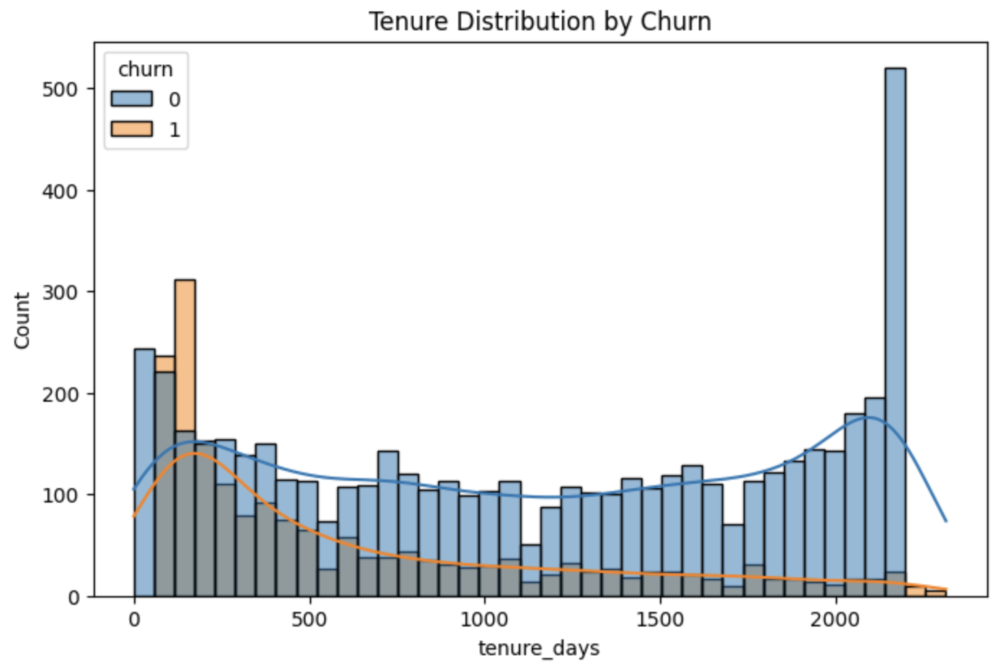
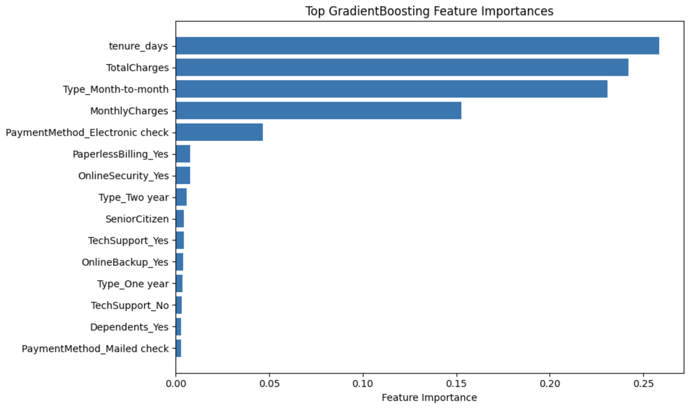

# Telecom Churn Prediction

## 📌 Project Overview
The goal of this project is to predict customer churn for a telecom operator using machine learning.  
By identifying customers who are likely to leave, the company can proactively offer targeted promotions and retention incentives.

The project covers the full data science workflow: exploratory data analysis, feature engineering, model training, hyperparameter tuning, and business interpretation.

---

## 📊 Data Description
The dataset contains customer-level information, including:
- Contract details
- Billing and payment methods
- Internet and phone services
- Customer demographics

The target variable is **churn**, indicating whether a customer has ended their contract.

---

## 🔍 Exploratory Data Analysis (EDA)
Key findings from EDA include:
- Churn is strongly associated with **short customer tenure**
- **Month-to-month contracts** show significantly higher churn
- Higher **monthly charges** increase churn risk
- Customers without value-added services (OnlineSecurity, TechSupport) churn more frequently

📈 Example visualization:

---

## ⚙️ Feature Engineering & Preprocessing
- Created a **tenure feature** based on contract start date
- Removed data leakage features
- Handled missing values using imputation
- Encoded categorical variables with One-Hot Encoding
- Scaled numerical features where appropriate
- Split data into **train / validation / test** sets

---

## 🤖 Models Trained
The following models were trained and evaluated:

| Model | AUC-ROC | Accuracy |
|------|--------|----------|
| Dummy Classifier | 0.50 | 0.73 |
| Logistic Regression | 0.85 | 0.74 |
| Random Forest (tuned) | 0.90 | 0.86 |
| **Gradient Boosting (tuned)** | **0.90+** | **0.86+** |

Gradient Boosting was selected as the final model based on superior validation and test performance.

---

## ⭐ Final Model Performance
**Final model:** Tuned GradientBoostingClassifier  
- **AUC-ROC:** ~0.90  
- **Accuracy:** ~0.86  

This performance exceeds the project’s highest evaluation threshold.

---

## 🔑 Feature Importance
The most influential drivers of churn were:
1. **Tenure (tenure_days)**
2. **TotalCharges**
3. **Month-to-month contract type**
4. **MonthlyCharges**
5. **Electronic payment method**

---

## 💡 Business Insights
- Short-tenure, month-to-month customers are the highest churn risk
- High monthly pricing increases churn likelihood
- Customers without security or support add-ons are more likely to leave
- Targeted discounts, contract upgrades, and service bundling could reduce churn

---

## 🚀 Future Improvements
- Incorporate customer usage behavior if available
- Optimize decision thresholds for retention campaigns
- Test advanced models such as XGBoost or CatBoost
- Evaluate cost-sensitive churn strategies

---

## 🛠 Tech Stack
- Python
- pandas, NumPy
- scikit-learn
- matplotlib, seaborn
- Jupyter Notebook
